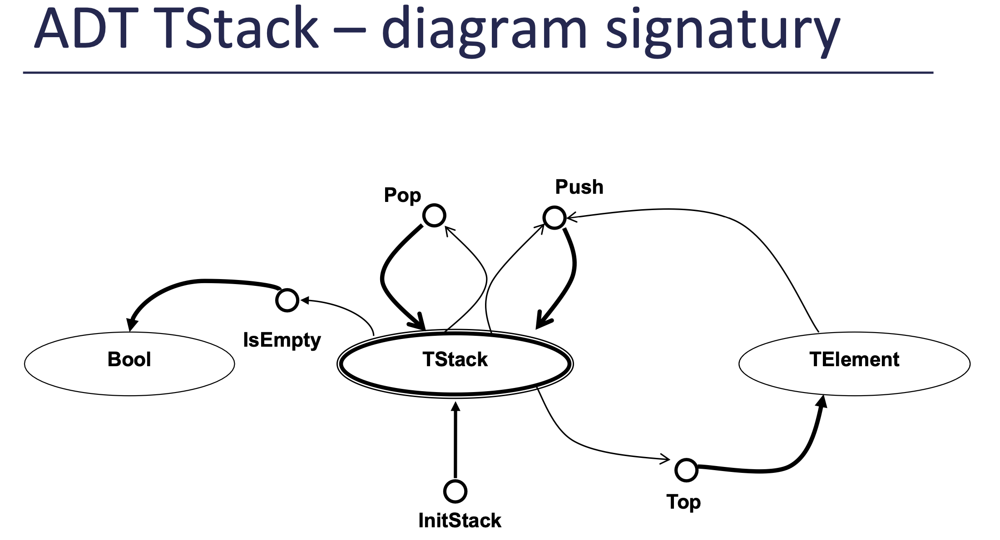

- [Úvod](#uvod)
- [Lineární abstraktní datové typy](#linearni-abstraktni-datove-typy)
- [Zásobník a fronta](#zasobnik-a-fronta)
- [Stromové datové struktury](#stromove-datove-struktury)
- [Vyhledávací tabulky](#vyhledavaci-tabulky)
- [Řazení](#razeni)
- [Vyhledávání v textu](#vyhledavani-v-textu)
- [Dynamické programování](#dynamicke-programovani)
- [Hashovací funkce](#hashovaci-funkce)

# Úvod

## Algoritmus
- Konečná, uspořádaná množina úplně definovaných pravidel pro vyřešení nějakého problému
- Posloupnost výpočetních kroků, které transformují vstup na výstup

## Heuristika
- Postup, který nedává vždy přesné řešení problému.
- Ve většině případů dává dostatečně přesné řešení v rozumném čase.
- Nezaručuje nalezení přesného řešení.
- Použijeme tehdy, pokud pro daný problém neexistuje přesný algoritmus, nebo jeho použití je neekonomické.

## Asymptotická časová zložitost
Odvozena od počtu tzv. elementárních operací: sčítání, násobení, porovnání, skoky, atd.

Používají se tři různé složitosti:
- O – Omikron (velké O, Ό, big O) – horní hranice chování
- Ω – Omega – dolní hranice chování
- Θ – Théta – třída chování

## Prostorová složitost
- Měří paměťové nároky algoritmu
- Kolik nejvíce elementárních paměťových buněk algoritmus použije.
- Elementární paměťová buňka: proměnná typu integer, float, byte apod.

# Lineární abstraktní datové typy

## Abstraktní datový typ (ADT)
Abstraktní datový typ (ADT) je definován množinou hodnot, kterých smí nabýt každý prvek tohoto typu, a množinou operací nad tímto typem.

## ADT TList


## Rekurzivní definice

### Délka seznamu
Je-li seznam prázdný, má délku nula. V jiném případě je jeho délka 1 plus délka zbytku seznamu.

### Ekvivalence dvou seznamů
Dva seznamy jsou ekvivalentní, když jsou oba prázdné nebo když se rovnají jejich první prvky a současně jejich zbytky.

# Zásobník a fronta




## Převod infixové notace na postfixovou

1. Zpracovávej vstupní řetězec položku po položce zleva doprava a vytvářej postupně výstupní řetězec. 
2. Je-li zpracovávanou položkou operand, přidej ho na konec vznikajícího výstupního řetězce.
3. Je-li zpracovávanou položkou levá závorka, vlož ji na vrchol zásobníku.
4. Je-li zpracovávanou položkou operátor, pak ho na
vrchol zásobníku vlož v případě, že:
    - zásobník je prázdný
    - na vrcholu zásobníku je levá závorka
    - na vrcholu zásobníku je operátor s nižší prioritou

    Je-li na vrcholu zásobníku operátor s vyšší nebo shodnou prioritou, odstraň ho, vlož ho na konec výstupního řetězce a opakuj krok 4, až se ti podaří operátor vložit na vrchol.
1. Je-li zpracovávanou položkou pravá závorka, odebírej z vrcholu položky a dávej je na konec výstupního řetězce, až narazíš na levou závorku. Levou závorku odstraň ze zásobníku. Tím je pár závorek zpracován.
2. Je-li zpracovávanou položkou omezovač **=**, pak postupně odstraňuj prvky z vrcholu zásobníku a přidávej je na konec řetězce, až zásobník zcela vyprázdníš, a na konec přidej rovnítko.

## Prioritní fronta
- Prvkům fronty je navíc přiřazena priorita.
- Prvky s vyšší prioritu přeskakují prvky s nižší prioritou a jsou obsluhovány dříve než prvky s nižší prioritou.
- Jako první opouští frontu nejstarší prvek s nejvyšší prioritou.

## Mapovací funkce
- Převádí n-tici indexů prvku n-dimenzionálního pole na jeden index jednorozměrného pole.
- Závisí na tom, jak je n-dimenzionální pole uloženo v paměti (po řádcích nebo po sloupcích).

# Stromové datové struktury

## Kořenový strom
Kořenový strom je souvislý acyklický graf, který má jeden zvláštní uzel, který se nazývá kořen (angl. root).

- Kořen je takový uzel, že platí, že z každého uzlu stromu vede jen jedna cesta do kořene.

## Výška stromu
- výška prázdného stromu je 0,
- výška stromu s jediným uzlem (kořenem) je 1,
- výška jiného stromu je počet hran od kořene k nejvzdálenějšímu uzlu + 1.

## Rekurzivní definice binárního stromu
Binární strom je buď prázdný, nebo sestává z jednoho uzlu zvaného kořen a dvou binárních podstromů – levého a pravého.

Binární strom sestává z:
- **kořene**,
- **neterminálních** (vnitřních) uzlů, které mají ukazatel na jednoho nebo dva uzly synovské a
- **terminálních** uzlů (listů), které nemají žádné potomky.

## Vyváženost stromu
- Binární strom je váhově vyvážený, když pro každý jeho uzel platí, že počty uzlů jeho levého a pravého podstromu se rovnají a nebo se liší právě o 1.
- Binární strom je výškově vyvážený, když pro každý jeho uzel platí, že výška levého podstromu se rovná výšce pravého podstromu a nebo se liší právě o 1.
- Maximální výška vyvážených stromů: **c.log(n)**

## Výška stromu – rekurzivně
```c
void HeightBT (TNode *ptr, int *max)
{
    int hl,hr;
    if (ptr != NULL){
        HeightBT(ptr->left,&hl);
        HeightBT(ptr->right,&hr);
        if (hl > hr) {
            *max = hl+1;
        } else {
            *max = hr+1;
        }
    } // if ptr != NULL
    else {
        *max = 0;
    }
}
```

nebo

```c
int max (int n1, int n2)
{ // funkce vrátí hodnotu většího ze dvou parametrů
    if (n1 > n2) {
        return n1;
    } else {
        return n2;
    }
}

int Height (TNode *ptr)
{
    if (ptr != NULL) {
        return max(Height(ptr->left),Height(ptr->right))+1;
    } else {
        return 0;
    }
}
```

## Ekvivalence (struktur) dvou BS
```c
bool EQTS (TNode *ptr1, TNode *ptr2)
{
    if ((ptr1 == NULL)||(ptr2 == NULL)){
        return ptr1 == ptr2;
    } else {
        return (EQTS(ptr1->left,ptr2->left) &&
        EQTS(ptr1->right,ptr2->right));
        // && (ptr1->data == ptr2->data) pro ekvivalenci BS
    }
}
```

## Kopie BS – rekurzivně
```c
TNode * CopyR (TNode *orig)
{
    TNode *copy;
    if (orig != NULL){
        copy = (TNode *) malloc(sizeof(TNode));
        // zkontrolovat úspěšnost operace malloc
        copy->data = orig->data;
        copy->left = CopyR(orig->left);
        copy->right = CopyR(orig->right);
        return copy;
    } else {
        return NULL;
    }
}
```

## Test váhové vyváženosti BS
```c
bool TestWBT (TNode *ptr, int *count)
{
    bool left_balanced, right_balanced;
    int left_count, right_count;
    if (ptr != NULL){
        left_balanced = TestWBT(ptr->left,&left_count);
        right_balanced = TestWBT(ptr->right,&right_count);
        *count = left_count + right_count + 1;
        return  (left_balanced && right_balanced &&
                (abs(left_count - right_count) <= 1));
    } else {
        *count = 0;
        return true;
    }
}
```

## Level-order průchod
```c
void LevelOrder (TDLList *l, TNode *ptr)
{ /* globální fronta ukazatelů */
    InitQueue(&q1);
    Add(&q1,ptr);
    while (!IsEmpty(&q1)) {
        TNode *aux = Front(&q1);
        Remove(&q1);
        if (aux != NULL) {
            DLL_InsertLast(l,aux->data);
            Add(&q1,aux->left);
            Add(&q1,aux->right);
        }
    } //while
}
```

# Vyhledávací tabulky

- Každá položka má zvláštní složku – klíč
- V tabulce s (ostrým) vyhledáváním je hodnota klíče jedinečná (neexistují dvě či více položek se stejnou hodnotou klíče).


## Sekvenční vyhledávání
```javascript
bool function Search (TTable t, TKey k)
    found ← false
    i ← 0
    while not found and (i < t.n):
        if k = t.array[i].key:
            found ← true
        else:
            i ← i + 1
    return (found)
```

## Sekvenční vyhledávání se zarážkou
Zarážka (sentinel, guard, stop-point):
- Dovoluje vynechat test na konec pole.
- Sníží efektivní kapacitu tabulky o jednu položku.
- Vynecháním testu na konec se algoritmus zrychlí.

```javascript
bool function SearchG (TTable t, TKey k)
    i ← 0
    t.array[t.n].key ← k // vložení zarážky
    while k != t.array[i].key:
        i ← i + 1
    return (i != t.n)
    // když našel až zarážku, tak vlastně nenašel ...
```

## Binární vyhledávání

- Lze provést nad seřazenou množinou klíčů ve struktuře s náhodným přístupem (v poli).
- Připomíná metodu půlení intervalu pro hledání jediného kořene funkce v daném intervalu
- Výhoda: časová složitost vyhledávání je v nejhorším případě logaritmická: **log₂(n)**

```js
left ← 0 right ← t.n-1 // levý index
// pravý index
do:
    middle ← (left+right) div 2
    if k < t.array[middle].key:
        // hledaná položka je vlevo
        right← middle - 1 
    else:
        // hledaná položka je vpravo
        left ← middle + 1 
while (k != t.array[middle].key) and (left ≤ right)
return (k = t.array[middle].key)
```

### Dijkstrova varianta
Dijkstrova varianta umožňuje existenci více prvků se shodným klíčem

```js
left ← 0
right← t.n-1
while right != (left+1):
    middle←(left+right) div 2
    if t.array[middle].key ≤ k:
        left ← middle
    else:
        right← middle
return ((k = t.array[left].key), left)
```

Dijkstrova varianta končí **vždy za stejnou dobu**, určenou hodnotou dvojkového logaritmu počtu prvků.

## Vyhledávání v binárním stromu
- Je-li vyhledávaný **klíč roven kořeni**, vyhledávání končí úspěšným vyhledáním.
- Je-li klíč **menší**, pokračuje vyhledávání v **levém podstromu**, je-li **větší**, pokračuje v **pravém podstromu**.
- Vyhledávání končí neúspěšně, pokud je prohledávaný (pod)strom **prázdný**.

```js
bool function Search (TNode *rootPtr, TKey k)
if rootPtr = NULL:
    return (false) // nenašli jsme
else:
    if rootPtr->key = k:
        return (true) // našli jsme
    else:
    if k < rootPtr->key: // hledáme v levém podstromu
        return (Search(rootPtr->lPtr,k))
    else: // hledáme v pravém podstromu
        return (Search(rootPtr->rPtr,k))
```

### BVS – Insert (rekurzivní zápis)
```js
TNode* function Insert (TNode *rootPtr, TKey k, TData d)
    if rootPtr = NULL: // vytvoření nového uzlu
        return CreateNode(k,d)
    else:
        if k < rootPtr->key: // jdeme vlevo
            rootPtr->lPtr ← Insert(rootPtr->lPtr,k,d)
        else:
            if rootPtr->key < k: // jdeme vpravo
                rootPtr->rPtr ← Insert(rootPtr->rPtr,k,d)
            else: // přepíšeme stará data novými
                rootPtr->data← d
        return rootPtr
```

### BVS Rušení uzlu – operace Delete
Uzel nezrušíme fyzicky, ale přepíšeme hodnotou takového uzlu, který lze zrušit snadno, a při přepisu nedojde k porušení uspořádání BVS.

Vhodný uzel:
- **nejpravější uzel levého podstromu rušeného uzlu** (maximum v levém podstromu) nebo
- **nejlevější uzel pravého podstromu rušeného uzlu** (minimum v pravém podstromu).

```js
TNode* function BVSMin (TNode *rootPtr)
// funkce vrátí ukazatel na nejlevější uzel v daném
// neprázdném(!) stromu
    if rootPtr->lPtr = NULL: // další levý už neexistuje
        return rootPtr
    else: // pokračujeme vlevo
        return BVSMin(rootPtr->lPtr)

TNode* function BVSDelete (TNode *rootPtr, int k)
    if rootPtr = NULL: // prázdný (pod)strom
        return NULL
    else:
        if k < rootPtr->key: // rušený klíč je v levém podstromu
            rootPtr->lPtr← BVSDelete(rootPtr->lPtr,k)
            return rootPtr
        else:
            if rootPtr->key < k: // rušený klíč je v pravém podstromu
                rootPtr->rPtr← BVSDelete(rootPtr->rPtr,k)
                return rootPtr
            else: // nalezen uzel s daným klíčem
                if (rootPtr->lPtr = NULL) and (rootPtr->rPtr = NULL):
                    free(rootPtr) // rušený nemá žádného syna
                    return NULL
                else:
                    if (rootPtr->lPtr != NULL) and (rootPtr->rPtr != NULL):
                        // rušený má oba podstromy
                        TNode *min ← BVSMin(rootPtr->rPtr) // najdi minimum
                        rootPtr->key← min->key // nahraď
                        rootPtr->data ← min->data
                        rootPtr->rPtr← BVSDelete(rootPtr->rPtr,min->key)
                        return rootPtr
                    else: // rušený má pouze jeden podstrom
                        if rootPtr->lPtr = NULL: // rušený nemá levého syna
                            TNode *onlyChild← rootPtr->rPtr
                        else: // rušený nemá pravého syna
                            TNode *onlyChild← rootPtr->lPtr
                        free(rootPtr)
                        return onlyChild
```

## AVL stromy
- **Výškově vyvážený strom**
- Je maximálně o 45 % vyšší než váhově vyvážený strom.
- Výškově vyvážený binární vyhledávací strom je strom, pro
jehož každý uzel platí, že výška jeho dvou podstromů je stejná
nebo se liší o 1.
- **Kritický uzel** – nejvzdálenější uzel od kořene, v němž je v důsledku vkládání
nebo rušení porušená rovnováha.

Každému uzlu přiřadíme váhu takto:
- 0: zcela vyvážený uzel
- -1: výška levého podstromu je o jedna větší
- 1: výška pravého podstromu je o jedna větší

Pokud v rámci operace Insert nebo Delete dojde ke změně váhy na hodnotu -2/2, je potřeba situaci napravit.
Mohou nastat 4 různé situace, které se napravují různými způsoby:
- **LL**: kritický uzel je příliš těžký vlevo a jeho levý syn je těžký vlevo
- **LR**: kritický uzel je příliš těžký vlevo a jeho levý syn je těžký vpravo
- **RR**: kritický uzel je příliš těžký vpravo a jeho pravý syn je těžký vpravo
- **RL**: kritický uzel je příliš těžký vpravo a jeho pravý syn je těžký vlevo

- Situaci LL opravíme pravou rotací
- Situaci LR opravíme dvojitou rotací – levá rotace následovaná pravou rotací
- Situaci RR opravíme levou rotací
- Situaci RL opravíme dvojitou rotací – pravá rotace následovaná levou rotací

## (a,b)-stromy
(a,b)-strom pro parametry a ≥ 2, b ≥ 2a-1 je obecný vyhledávací strom,
pro který navíc platí:
1. Kořen má 2 až b synů, ostatní vnitřní vrcholy a až b synů.
2. Všechny vnější vrcholy jsou ve stejné hloubce.

(a,b)-strom s n klíči má hloubku **Θ(log n)**.
Časová složitost: **Θ(log n)** (délka všech cest od kořene k listům je stejná)
Obvykle se používají (a, 2a-1) nebo (a,2a)-stromy, časté parametry: **(2,3)** nebo **(2,4)**


**Varianta**: zcela naplněné uzly jsou štěpeny už cestou dolů stromem, při vyhledávání místa, kam má být nový prvek vložen.


## LLRB stromy
LLRB strom je binární vyhledávací strom s vnějšími vrcholy, jehož hrany jsou obarveny červeně a černě. Přitom platí následující axiomy:
1. Neexistují dvě červené hrany bezprostředně nad sebou.
2. Jestliže z vrcholu vede dolů jediná červená hrana, pak vede doleva.
3. Hrany do listů jsou vždy obarveny černě. (To se hodí, jelikož listy jsou pouze virtuální, takže do nich neumíme barvu hrany uložit.)
4. Na všech cestách z kořene do listu leží stejný počet černých hran.

LLRB strom – překlad (2,4) stromu na BVS s **logaritmickou hloubkou** a možností vyvažování.

### Překlad (2,4)-stromu na LLRB
Každý vrchol (2,4)-stromu nahradíme konfigurací jednoho nebo více binárních vrcholů.

Pro zachování korespondence mezi stromy zavedeme 2 barvy hran:
- Červené hrany – spojují vrcholy tvořící 1 konfiguraci
- Černé hrany – hrany mezi konfiguracemi (hrany původního stromu)

Vrcholy označujeme dle počtu synů jako 2-vrchol, 3-vrchol, 4-vrchol.

Transformace 3-vrcholu – nahradíme 2 vrcholy a červená hrana musí vždy vést **doleva**.

### Vkládání v LLRB
- Vyváženost stromu je udržována rotacemi, a to jen **červených** hran.
- Nový uzel vkládáme na nejnižší hladinu, připojujeme ke stromu pomocí červené hrany a v případě potřeby (červená hrana vedoucí doprava nebo 2 červené hrany nad sebou) rotujeme.


- Při cestě stromem dolů **štěpíme zcela zaplněné uzly** (4-vrcholy)
- Štěpení je realizováno pomocí **přebarvení** – tím se uzel rozštěpí a prostřední klíč se stane součástí nadřazeného vrcholu (víme jistě, že se tam vleze, protože všechny 4-vrcholy rovnou štěpíme).
- Na nejnižší úrovni vložíme uzel.
- Štěpení může zanechat ve stromu špatné konfigurace červených hran (červená hrana vedoucí doprava, nebo 2 červené hrany nad sebou) – opravujeme pomocí **rotací při cestě stromem zpět ke kořeni** (jednoduché při využití rekurze)


## Tabulka s přímým přístupem (TPP)
- Implementace vyhledávací tabulky polem, ve které jsou klíče mapovány na indexy pole:
  - Ideální struktura z pohledu vyhledávání
  - Bohužel obvykle nerealizovatelná

- Vyžaduje **vzájemně jednoznačné zobrazení (bijekce)** mapující každý prvek množiny klíčů K do množiny indexů pole H (sousedních adres v paměti).
- Vyhledávání: spočívá v přímém zjištění, zda na pozici klíče (indexu) dané tabulky je nebo není obsazeno.
- Časová složitost přístupu v TPP: **Θ(1)**
- **Obtíž**: nalezení **vhodné mapovací funkce**.

## Mapovací funkce
- Nalezení vzájemně jednoznačného zobrazení (mapovací funkce) je velmi obtížné => je potřeba počítat s tím, že běžná mapovací funkce může **různým klíčům přiřadit stejnou hodnotu** (stejné místo v paměti).
- **Kolize** – dva různé klíče jsou namapovány do stejného místa.
- **Synonyma** – dva nebo více klíčů, které jsou namapovány do téhož místa.

- Nechť je dáno mapovací pole s rozsahem [0…N] nebo [1…N].
- Mapovací funkce transformuje klíč na index v daném rozsahu.
- Typicky lze rozdělit do dvou etap:
    - převod klíče na přirozené číslo (N>0),
    - převod přirozeného čísla na hodnotu spadající do intervalu (nejčastěji s použitím operace modulo).

### Mapovací funkce – požadavky
- **Determinismus** - Pro daný klíč vrátí vždy stejnou hodnotu.
- **Rovnoměrné (uniformní) rozložení** - Na každé místo se mapuje přibližně stejně velké množství klíčů.
- **Využití celých vstupních dat**
- **Vyhnutí se kolizím podobných klíčů** - V praxi bývá řada klíčů velice podobných.
- **Rychlý výpočet**

### Ukázka mapovací funkce – BKDR
```c
unsigned int BKDRHash(char* str, unsigned int length)
{
    unsigned int seed = 131;
    unsigned int hash = 0;
    unsigned int i = 0;
    for (i = 0; i < length; str++, i++)
    {
        hash = (hash * seed) + (*str);
    }
    return hash;
}
```

### Ukázka mapovací funkce – DJB
```c
unsigned long DJBHash(unsigned char *str)
{
    unsigned long hash = 5381;
    int c;
    while (c = *str++)
        // hash * 33 + c
        hash = ((hash << 5) + hash) + c;
    return hash;
}
```

## Tabulka s rozptýlenými položkami
Tabulka s rozptýlenými položkami (TRP) sestává:
- z mapovacího prostoru (pole) a
- ze seznamů synonym.

Seznam synonym (i prázdný) začíná na každém prvku mapovacího pole.
- **Explicitní zřetězení** – adresa následníka je obsažena v jeho předchůdci (zřetězení záznamů).
- **Implicitní zřetězení** – adresa následníka se získá pomocí funkce z adresy předchůdce (otevřená adresace).

Princip vyhledávání v TRP spočívá ve dvou krocích:
1. **Nalezení indexu prvku v poli** k danému klíči pomocí mapovací funkce (na tomto indexu začíná seznam synonym, které se namapovaly do tohoto místa).
2. **Sekvenční průchod** tímto seznamem synonym (vyhledáváme položku s daným klíčem).

Vyhledávání v TRP má **index-sekvenční** charakter.

### TRP s explicitním zřetězením synonym
- Seznam synonym je obvykle realizován jako **lineární seznam**.
- Maximální doba vyhledávání je pak dána délkou nejdelšího seznamu synonym – **O(n)**.
- Místo lineárních seznamů pro uložení synonym lze použít **vyvažované binární vyhledávací stromy**.
- Pak je časová složitost v nejhorším případě **O(log₂ n)**.

### TRP s implicitním zřetězením synonym
- TRP implementovaná polem, ve kterém jsou uloženy jak první prvky seznamů synonym, tak jejich další položky.

- Pro přístup k synonymům existují různé metody pro určení kroku:
  - Lineární: `h(k, i) = (h(k) + C*i) % (Max+1)`
  - Kvadratická: `h(k, i) = (h(k) + C1*i + C2*i2) % (Max+1)`
  - S dvojí rozptylovací funkcí: `h(k, i) = (h1(k) + h2(k)*i) % (Max+1)`

kde
i = 0, 1, 2, … – pokusy o vložení
C, C1, C2– konstanty
Max+1 – velikost pole

#### Implicitní zřetězení s pevným krokem
- Krok = 1: **a(i+1) = a(i) + 1**
- Konec seznamu synonym je dán **prvním volným prvkem**, který se najde se zadaným krokem.
- Nové synonymum se vloží na první volné místo (**na konec seznamu**).
- Tabulka (pole) musí obsahovat **alespoň jeden volný prvek**. Efektivní kapacita je o 1 menší než počet položek.
- Tabulka je implementovaná **kruhovým polem**.


#### Velikost rozptylovacího pole
- Krok s hodnotou 1 má tendenci vytvářet shluky (angl. **cluster**).
- Výhodnější je krok **větší než 1**.
- Kdyby měl krok hodnotu prvočísla, které je nesoudělné s jakoukoli velikostí pole, pak by mohl postupně projít všemi prvky pole.
- Výhodnější ale je, aby **hodnotu prvočísla měla velikost mapovacího pole**. Pak jakýkoli krok dovolí projít všemi prvky mapovacího pole.
- Je vhodné dimenzovat velikost mapovacího pole TRP tak, aby bylo rovno prvočíslu. 

#### TRP s dvojí rozptylovací funkcí


#### Brentova varianta
- Brentova varianta je **varianta metody TRP se dvěma rozptylovacími funkcemi**.
- Brentova varianta provádí **při vkládání rekonfiguraci prvků** pole s cílem **investovat do vkládání** a získat lepší průměrnou dobu vyhledání.


#### Hodnocení TRP s implicitním zřetězením
- Operaci **Delete** lze řešit pomocí **zaslepení** – vložením klíče, který nebude nikdy vyhledáván.
- TRP s implicitním zřetězením je vhodná v aplikacích, v nichž se **operace Delete nepoužívá příliš často**.
- Maximální kapacita TRP pro rozsah pole <0..Max> je **Max** (o 1 menší než počet prvků pole) – alespoň jeden prvek musí zůstat jako **zarážka vyhledávání**.

## Hodnocení metod vyhledávání
| Metoda vyhledávání                            | Časová složitost          |
|-----------------------------------------------|---------------------------|
| Sekvenční vyhledávání                         | *n*                       |
| Binární vyhledávání v seřazeném poli          | *log₂ n*                  |
| Binární vyhledávací strom                     | *log₂ n*                  |
| BVS při degradaci na seznam                   | *n*                       |
| Vyvažovaný BVS (např. AVL)                    | *log₂ n*                  |
| TRP                                           | *1*                       |
| TRP při maximální kolizi klíčů                | *n*                       |
| TRP při maximální kolizi a vyváženém stromu   | *log₂ n*                  |

# Řazení
**Třídění** (**sorting**) položek neuspořádané množiny je uspořádání do tříd podle hodnoty daného atributu – klíče položky.

**Řazení** (**ordering**, **sequencing**) je uspořádání položek podle **relace lineárního uspořádání** nad klíči.

**Setřídění** (**merging**) je vytváření souboru seřazených položek sjednocením několika souborů položek téhož typu, které jsou již seřazeny.

## Vlastnosti řadicích algoritmů
- **Přirozenost** – algoritmus se chová přirozeně pokud:
    - je doba potřebná k seřazení náhodně uspořádaného pole větší, než k seřazení již uspořádaného pole
    - a doba potřebná k seřazení opačně seřazeného pole je větší, než doba k seřazení náhodně uspořádaného pole.
    - Jinak říkáme, že se algoritmus nechová přirozeně.
- **Stabilita** vyjadřuje, zda mechanismus algoritmu zachovává relativní pořadí klíčů se stejnou hodnotou.

## Řazení podle více klíčů
Problém lze řešit třemi způsoby:
- Složená relace uspořádání
- Opakované řazení
- Aglomerovaný klíč

### Aglomerovaný klíč
Uspořádaná N-tice klíčů se konvertuje na vhodný typ, nad nímž je definována relace uspořádání.

Příklad aglomerovaného klíče: Rodné číslo

## Řazení polí bez přesunu položek
V případě dlouhých položek jsou přesuny časově velmi náročné => řazení polí bez přesunu položek.

Implementace:
- K řazenému poli vytvoříme **pomocné pole** (tzv. pořadník, location).
- Po dokončení řazení pořadník udává, v jakém pořadí by měly být seřazeny položky původního pole (na první pozici pořadníku je index prvního prvku seřazeného pole atd.).

Chceme-li mít na konci **seřazené pole**:
- Přeskládáme prvky do výstupního pole s využitím pořadníku.
- Prvky zřetězíme a přeskládáme do výstupního pole, nebo přeskládáme v
poli samotném.

## Klasifikace algoritmů řazení
- Podle **přístupu k paměti**:
    - metody vnitřního řazení (**řazení polí**) – přímý (náhodný) přístup
    - metody vnějšího řazení (**řazení souborů a seznamů**) – sekvenční přístup
- Podle **typu procesoru**:
    - **sériové** (jeden procesor) – jedna operace v daném okamžiku
    - **paralelní** (více procesorů) – více souběžných operací
- Podle **principu** řazení:
    - Princip **výběru** (selection) – přesouvají maximum/minimum do výstupní posloupnosti.
    - Princip **vkládání** (insertion) – vkládají postupně prvky do seřazené výstupní posloupnosti.
    - Princip **rozdělování** (partition) – rozdělují postupně množinu prvků na dvě podmnožiny tak, že prvky jedné jsou menší než prvky druhé.
    - Princip **slučování** (merging) – setřiďují se postupně dvě seřazené posloupnosti do jedné.
    - Jiné principy ...

## Řazení na principu výběru (Select sort)
- Jádrem metody je nalezení extrémního prvku v zadaném segmentu pole a jeho výměna na konec (začátek) seřazené části pole.
- Takto je nalezeno *MAX-1* minim (maxim), která jsou umístěna na svoji pozici.

### Select sort

```js
procedure SelectSort (TArray A)
    for i ← (0, MAX-2):
        indexMin ← i // Poloha pomocného minima
        min ← A[i] // Pomocné minimum
        for j ← (i+1, MAX-1):
            if min > A[j]:
                min ← A[j]
                indexMin ← j
        A[i] <-> A[indexMin]
```

- Metoda je **nestabilní**. Vyměněný první prvek se může dostat za prvek se shodnou hodnotou.
- Má **kvadratickou časovou složitost**.

### Metoda bublinového výběru – Bubble sort
- Princip stejný jako u metody Select sort.
- Liší se metodou nalezení extrému a jeho přesunu:
  - Porovnává se každá dvojice a v případě obráceného uspořádání se přehodí.

```js
procedure BubbleSort (TArray A)
    // průchod zprava – minimum doleva
    i ← 1
    do:
        finish ← true
        for j ← (MAX-1, i)-1: // bublinový cyklus
            if A[j-1] > A[j]:
                A[j-1] <-> A[j]
                finish ← false
        i ← i+1
    while (not finish) and (i < MAX)
```

```js
procedure BubbleSort2 (TArray A)
    // průchod zleva – maximum doprava
    auxN ← MAX-1
    continue ← true
    while continue and (auxN > 0):
        continue ← false
        for i ← (0, auxN-1): // bublinový cyklus
            if A[i+1] < A[i]: 
                A[i+1] <-> A[i]
                continue ← true // výměna – nelze skončit
        auxN ← auxN-1
```

- Bublinový výběr je metoda **stabilní** a přirozená. Je to jedna z mála metod použitelná pro vícenásobné řazení podle více klíčů!
- Má časovou složitost **kvadratickou**.
- Je to nejrychlejší metoda v případě, že pole je již seřazené!

#### Bubble sort – varianty
Od Bubble sortu byla odvozena řada vylepšených variant:
- **Ripple sort**: pamatuje si polohu první výměny a je-li větší než 1, neprochází dvojicemi, u nichž je jasné, že se nebudou vyměňovat.
- **Shaker sort**: střídá směr probublávání zleva a zprava (používá houpačkovou metodu) a skončí uprostřed.
- **Shuttle sort**: zavede při výměně dvojice menší prvek na své místo a teprve pak pokračuje dál. Končí tím, že nevymění nejpravější dvojici.

### Řazení hromadou – Heap sort
**Hromada (halda, heap)** je struktura stromového typu, pro niž platí, že mezi otcovským uzlem a všemi jeho synovskými uzly platí **stejná relace uspořádání**.

Nejčastější případ hromady je **binární hromada**, která je založená na binárním stromu, pro který navíc platí:
- Všechny hladiny kromě poslední jsou plně obsazené.
- Poslední hladina je zaplněna zleva.

#### Rekonstrukce hromady
Významnou operací nad hromadou je její **rekonstrukce** poté, co se poruší pravidlo hromady v jednom uzlu.

Nejvýznamnějším případem je porušení v kořeni.

Operace **Sift** (prosetí nebo také zatřesení hromadou):
  - Operace, která znovuustaví hromadu porušenou v kořeni.
  - Prvek z kořene se postupnými výměnami **propadne** na své místo a do kořene se dostane prvek splňující pravidla hromady.
  - Operace má v nejhorším případě složitost **log₂ n**. 

#### Implementace hromady polem
Protože musí být zaplněny všechny hladiny kromě poslední a poslední musí být zaplněna zleva, můžeme strom ukládat do pole **po hladinách**.

Pak **platí pro otcovský a synovské uzly vztah**: 
když je otcovský uzel na indexu *i*, pak je levý syn na indexu *2i+1* a pravý syn na indexu *2i+2*.

##### Vytvoření hromady
- Začneme s **nejnižším a nejpravějším otcovským uzlem** – ten je kořenem hromady (podstromu), která je porušená v kořeni. Operací Sift opravíme.
- Dále **postupujeme po všech otcovských uzlech doleva a nahoru** až k hlavnímu kořeni.


Má-li pole *MAX* prvků (indexováno od *0* do *MAX-1*), pak nejnižší a nejpravější otcovský uzel odpovídající hromady má index: *(MAX div 2) – 1*. Následující otcovské uzly leží na **předchozích** indexech.

Celkem musíme opravit n/2 hromad, celé ustavení hromady zvládneme v čase **n/2*log₂n**.

```js
procedure HeapSort (TArray A)
    // ustavení hromady
    left ← (MAX div 2)-1 // nejnižší a nejpravější otec
    right← MAX-1
    for i ← (left, 0):
        SiftDown(A,i,right)

    // vlastní cyklus Heap-sortu
    for right ← (MAX-1, 1):
        A[0] A[right]
        // výměna kořene s akt. posledním prvkem
        SiftDown(A,0,right-1) // znovuustavení hromady
```

```js
procedure SiftDown (TArray A, int left, int right)
    // left je index kořenového uzlu, který porušuje heap,
    // right je index posledního prvku heapu
    i ← left
    j ← 2*i+1 // index levého syna
    temp ← A[i] // pomocná proměnná
    continue ← j ≤ right // řídicí proměnná cyklu
    while continue:
        if j < right: // uzel má oba syny
            if A[j] < A[j+1] // pravý syn je větší
                j← j+1 // pokračujeme tedy s ním
        if temp ≥ A[j]: // temp našel své místo = konec
            continue ← false
        else: // temp padá níž, A[j] jde o úroveň výš
            A[i]← A[j]
            i ← j // syn je otcem v dalším cyklu
            j← 2*i+1 // nový levý syn
            continue ← j ≤ right // pokračujeme až na list
    A[i]← temp // konečná pozice „propadajícího“ kořene
```

#### Zhodnocení
- Heap sort je řadicí metoda s **linearitmickou složitostí**, protože sift umí rekonstruovat hromadu (najít extrém mezi N prvky) s logaritmickou složitostí.
-  Heap sort je **nestabilní** a **nechová se přirozeně**.

#### Další využití hromady
Prioritní frontu lze implementovat binární hromadou. V kořeni bude vždy prvek s maximální/minimální prioritou.


## Řazení na principu vkládání
Pole dělíme na dvě části:
- Levou – seřazenou a pravou – neseřazenou.
- Levou část tvoří na začátku první prvek.

Algoritmus řazení má následující strukturu:
```js
for i ← (1, MAX-1):
// najdi v levé části index k, kam se má zařadit prvek A[i]
// posuň část pole od k do i-1 o jednu pozici doprava
// vlož na A[k] hodnotu zařazovaného prvku
```

### Bubble-insert sort
Kombinuje vyhledání místa pro vkládání i posun segmentu pole do jednoho cyklu postupným porovnáváním a výměnou dvojic prvků.

```js
procedure BubbleInsertSort (TArray A)
    for i ← (1, MAX-1):
        tmp ← A[i]
        j ← i-1
        while j ≥ 0 and tmp < A[j]: // zkrat. vyhodnocování!
            // najdi a posuň prvek
            A[j+1]← A[j]
            j← j-1
        A[j+1] ← tmp // konečné vložení na místo
```

- Metoda je **stabilní** – je vhodná pro vícenásobné řazení podle více klíčů.
- Chová se **přirozeně** a pracuje **in situ**.
- Má **kvadratickou** časovou složitost.


### Binary-insert sort
Pro vložení prvku vyhledáváme místo v **seřazené posloupnosti** – lze využít **binární vyhledávání**.

V případě shodných klíčů musí metoda nalézt místo **za nejpravějším ze shodných klíčů** – varianta Dijkstrovy metody binárního vyhledávání.

```js
procedure BinaryInsertSort (TArray A)
    for i ← (1, MAX-1):
        tmp ← A[i]
        // hranice již seřazené části
        left ← 0 
        right← i-1
        while left ≤ right: 
            m ← (left+right) div 2 // binární vyhledání
            if tmp < A[m]:
                right← m-1
            else:
                left← m+1 // ale skončíme těsně za
        for j ← (i-1, left):
            A[j+1]← A[j] // posun segmentu pole doprava
        A[left] ← tmp // prvek z pozice i na své místo
```

- Metoda je **stabilní**.
- Chová se **přirozeně** a pracuje **in situ**.
- Má **kvadratickou** časovou složitost.

## Řazení rozdělováním

### Quick sort
Představme si algoritmus, který umí (rychle) rozdělit množinu položek na **dvě podmnožiny**:
- jedna by obsahovala všechny **prvky s klíčem menším** (nebo rovným) jisté hodnotě
- druhá by obsahovala všechny **prvky s klíčem větším** (nebo rovným) téže hodnotě

Mechanismu rozdělení říkáme **partition**.

**Medián** – prvek z množiny hodnot, pro který platí:
- Polovina prvků je menší než medián.
- Polovina prvků je větší než medián.

Při znalosti mediánu je snadné implementovat proceduru
`partition`, která rozdělí pole na dvě části:
- Procházíme pole současně zleva (index *i*) a zprava (index *j*).
- Zleva hledáme prvek větší nebo roven mediánu, zprava prvek menší nebo roven mediánu.
- Nalezené prvky vyměníme a hledáme další prvky pro výměnu.
- Proces ukončíme až se dvojice indexů překříží.
- ia jjsou návratové hodnoty funkce, definující intervaly *left..j* (prvky menší nebo rovny mediánu) a *i..right* (prvky větší nebo rovny mediánu).

#### Mechanismus partition I.
Protože hledání mediánu je časově náročné, použijeme tzv. **pseudomedián**:
- Libovolná hodnota z daného souboru čísel
- Vhodnou hodnotou je číslo ze středu intervalu: `(left+right) div 2`
- Experimentálně je prokázáno, že toto číslo splní svou roli velmi podobně jako medián.

Abychom nemuseli při hledání hodnot pro výměnu kontrolovat hranice pole, používáme pseudomedián jako **zarážku**.

```js
(int, int) function partition (TArray A, int left, int right)
    i ← left // inicializace i
    j ← right // inicializace j
    PM ← A[(i+j) div 2] // ustavení pseudomediánu
    do
        while A[i] < PM:
            i ← i+1 // první i zleva, pro A[i]>=PM
        while A[j] > PM:
            j ← j-1 // první j zprava pro A[j]<=PM
        if i ≤ j:
            A[i] <-> A[j] // výměna nalezených prvků
            i ← i+1
            j ← j-1
    while i ≤ j 
    return (i, j)

procedure QuickSort (TArray A, int left, int right)
    // Při volání má left hodnotu 0 a right hodnotu MAX-1
    i, j ← partition(A, left, right)
    if left < j:
        QuickSort(A, left, j) // Rekurze doleva
    if i < right:
        QuickSort(A, i, right) // Rekurze doprava
```

#### Mechanismus partition II.
- Jako pseudomedián (pivot) je volen nejpravější prvek
- Pole procházíme postupně zleva doprava (index j) a ve zpracované části udržujeme vlevo prvky menší nebo rovny pivotu (do indexu i) a vpravo prvky větší než pivot.
- Vždy když narazíme na prvek menší než pivot, vyměníme ho s prvním prvkem, který
je větší než pivot
- Nakonec je pivot vyměněn s prvním prvkem části pole s prvky většími než pivot.
- Partition vrací index nové pozice pivota, rekurzivní volání pokračují vlevo a vpravo od tohoto prvku
- Méně efektivní než předchozí mechanismus.

```js
int function partitionII (TArray A, int left, int right)
    i ← left - 1
    PM ← A[right] // ustavení pseudomediánu
    for j ← (left, right-1): // projdi pole zleva
        if A[j] ≤ PM: // menší musí do levé části
            i ← i+1 // za poslední prvek
            A[i] ↔ A[j] // výměna nalezených prvků
    A[i+1] ↔ A[right]
    return i+1

procedure QuickSortII (TArray A, int left, int right)
    if left < right:
        q ← partitionII (A, left, right)
        QuickSortII(A, left, q-1) // rekurze doleva
        QuickSortII(A, q+1, right) // rekurze doprava
```

#### Quick sort – nerekurzivní zápis
```js
procedure NonRecQuicksort (TArray A, int left, int right)
    InitStack(s)
    Push(s,left) // uložení hranic celého pole
    Push(s,right)
    while not IsEmpty(s): // vnější cyklus
        right ← Top(s)
        Pop(s) // čtení v opačném pořadí
        left ← Top(s)
        Pop(s)
        while left < right: // dokud je co dělit
            i,j ← Partition(A, left, right)
            Push(s,i) // interval pravé části do zás.
            Push(s,right)
            right ← j // pravý index pro další cyklus
```

#### Zhodnocení 
- Quick sort patří **mezi nejrychlejší** algoritmy pro řazení polí.
- Quick sort je **nestabilní** a **nepracuje přirozeně**.
- Časová složitost je **linearitmická** pro vhodně zvolený pseudomedián.
- V nejhorším případě – při špatné volbě pseudomediánu (vždy minimum nebo maximum), je časová složitost **kvadratická**.
  - zlepšení volby pseudomediánu – výběr mediánu ze tří náhodně vybraných hodnot

### Shell sort
Metoda řazení se **snižujícím se přírůstkem**. 
Metoda používá **opakované průchody polem**, ve kterých řadí vždy jen určitou **podposloupnost** původní sekvence:
- Původní sekvence je rozdělena na několik podposloupností, do kterých jsou vybrány **prvky vzdálené od sebe o určitý krok**.
- Prvky v každé podsekvenci jsou uspořádány jedním **bublinovým průchodem** (Bubble-insert sort).
- Po seřazení všech podposloupností se **krok zmenší** a **opakuje se řazení** pro nové podsekvence.
- V **poslední etapě** řazení je krok roven jedné, všechny prvky jsou v jedné podposloupnosti, a řazení je dokončeno posledním bublinovým průchodem.

```js
procedure ShellSort (TArray A)
    step ← MAX div 2 // první krok - polovina délky pole
    while step > 0:
        for i ← (step, MAX-1): // cykly pro paralelní n-tice
            j ← i-step
            while (j ≥ 0) and (A[j] > A[j+step]): //bubl.ins.
                A[j] ↔ A[j+step]
                j← j-step // snížení indexu o krok
        step ← step div 2 // půlení kroku
```

- Shell sort je **nestabilní** metoda.
- Pracuje **in situ**.
- Časová složitost závisí na zvolené řadě snižujících se kroků:
  - Pro uvedenou verzi (n/2, n/4, …, 1) je v nejhorším případě časová složitost **n^2^**.
  - Existují řady, pro které je časová složitost **n^3/2^** nebo **n*log₂ n**.


## Řazení na principu slučování

### Řazení setřiďováním – Merge sort
- Pole rozdělujeme do tzv. běhů – souvislých **úseků, které už jsou setříděny (seřazeny)**.
- Na začátku budou všechny běhy jednoprvkové.
- Poté budeme dohromady **slévat vždy dva sousední** běhy do jediného setříděného běhu o délce dané součtem počtu prvků slévaných běhů, který bude ležet na místě obou vstupních běhů.
- Po poslední iteraci bude posloupnost sestávat z jediného běhu, a bude tudíž setříděná (seřazená).

Metoda **vyžaduje pomocné (nebo pomocná) pole**, pro uložení
setříděné posloupnosti (nebo uložení vstupních posloupností).

**Rekurzivní varianta** – metoda postupně volá sebe sama pro levou a
pravou polovinu zadané části pole a při návratu z rekurze slévá již
setříděné posloupnosti

```js
procedure MergeSort (TArray A, int left, int right)
    // Při volání má left hodnotu 0 a right hodnotu MAX-1
    if (left < right):
        q ← (left + right) div 2
        MergeSort(A, left, q)
        MergeSort(A, q+1, right)
        Merge(A, left, q, right)
```

```js
procedure Merge (TArray A, int left, int mid, int right)
    left_count ← mid – left + 1 // počet prvků levé posloupnosti
    right_count ← right - mid // počet prvků pravé posloupnosti
    for i ← (0,left_count-1): // levá posloupnost do pom. pole
        L[i] ← A[left+i]
    for j ← (0,right_count-1): 
        R[j] ← A[mid+1+j] // začíná na indexu mid+1
    L[left_count] ← MaxInt // ustavení zarážek
    R[right_count] ← MaxInt
    i ← 0
    j ← 0
    for k ← (left,right): // slévání a vkládání do pole A
        if L[i] ≤ R[j]: // vyber menšího
            A[k] ← L[i] // menší byl v levé posloupnosti
            i ← i+1
        else:
            A[k] ← R[j]  // menší byl vpravo
            j ← j+1
```

- Jedná se o **stabilní** metodu.
- Potřebuje pomocné pole o stejné velikosti jako je zdrojové pole – tzn. **nepracuje in situ**.
- Časová složitost je **linearitmická**.

### Sequence-merge sort
Řazení **setřiďováním posloupností** – sekvenční metoda využívající přímý přístup k prvkům pole.
- Postupuje polem zleva a současně zprava a setřiďuje dvě **proti sobě** postupující neklesající posloupnosti. Výsledek se ukládá do cílového pole.
- Počet vzniklých posloupností se počítá v počitadle.
- Algoritmus **končí**, vznikne-li jen **jedna cílová posloupnost**.

#### Zhodnocení
- Významným rysem algoritmu je jeho **houpačkový mechanismus**:
  - automaticky střídá pozici zdrojového a cílového pole i krok postupující proti sobě orientovanými slučovanými neklesajícími posloupnostmi.
- Metoda Sequence-merge sort je **nestabilní**.
- **Nechová se přirozeně** a **nepracuje in situ**. 
- Asymptotická časová složitost je **linearitmická**.

### List-merge sort
- Řazení polí **setřiďováním seznamů** – pracuje na principu **slučování** metodou **bez přesunů položek**.
- K základnímu poli je nezbytné vytvořit stejně velké pomocné pole *Ptr* indexových ukazatelů, které **zřetězí neklesající posloupnosti**.
- Jádrem algoritmu je **setřídění dvou seznamů** zřetězených v pomocném poli indexovými ukazateli.

#### Princip
**První krok**: zřetězení neklesajících posloupností do seznamu a vložení jejich začátků do dvojsměrného seznamu začátků.

Následující **cyklus**:
- V každé iteraci se vyzvednou ze seznamu začátky **dvou** zřetězených neklesajících posloupností.
- **Setříděním** těchto posloupností vznikne jedna zřetězená neklesající posloupnost, jejíž začátek se vloží na konec seznamu.
- Cyklus se **ukončí**, je-li v seznamu již jen začátek jedné neklesající zřetězené posloupnosti.

#### Zhodnocení
- List-merge sort je algoritmus pracující **bez přesunu položek**.
- Je **potenciálně stabilní**.
- Stabilita se zajistí např. tím, že se začátky vkládají do dvojsměrného seznamu (na pozici vyjmutých začátků) a při setřiďování se u shodných prvků musí do výstupní posloupnosti vložit prvek první posloupnosti.

### Tim sort
- **Kombinuje** *Merge sort* a *Insert sort*.
- *Merge sort* je použit na **setřiďování neklesajících posloupností**.
- Pokud jsou neklesající posloupnosti příliš **krátké**, jsou metodou *insert sort* prodlouženy.
- Jsou setřiďovány vždy dvě sousední podposloupnosti – **stabilní** metoda.
- Nalezené/vytvořené podposloupnosti nemusí být setříděny hned, ale mohou být odloženy na **zásobník**. Díky tomu dochází k setřídění podobně dlouhých podposloupností.
- Použití dalších technik pro **zlepšení výkonnosti**: 
  - Binary-search (pro nalezení první/poslední pozice, které se dotkne vkládání), 
  - galloping mode (při vkládání více prvků za sebou ze stejné podposloupnosti), 
  - detekce klesajících posloupností, 
  - velikost běhů atd.
- Časová složitost je **linearitmická**, **nepracuje in situ**.

## Řazení tříděním podle základu 
Řazení tříděním podle základu je počítačová verze procesu
řazení na děrnoštítkových třídicích strojích.

Řazení tříděním podle základu je jednou z verzí tzv. *přihrádkového třídění* (bucket sort), které lze použít i na jiné než číselné klíče.

Řazení tříděním lze implementovat tak, aby šlo o metodu pracující **bez přesunu položek**.

### Radix sort
Radix sort využívá pomocné datové struktury:
- Seznamy (příp. fronty) prvků pro stejnou cifru.
- Pole pro uchování začátků jednotlivých seznamů.

Implementace s využitím přihrádek (např. s využitím jednosměrných seznamů).
Po každém roztřídění prvků jsou prvky znovu spojeny do jedné posloupnosti.

```
Vstupní posloupnost vlož do seznamu S
for j← (1, POCCIF) do
    // inicializace přihrádek
    // třídění prvků ze seznamu S do přihrádek dle j-té číslice
    // vytvoření prázdného seznamu S
    // postupné připojení všech přihrádek do seznamu S
end for
```
#### Hodnocení 
- Radix sort je stabilní metoda.
- Stav uspořádání nemá podstatný vliv na čas a proto se jeví, jako by se nechoval přirozeně.
- Metoda nepracuje in situ.
- Časová složitost je linearitmická.

## Zhodnocení řadicích metod


# Vyhledávání v textu
Budeme používat značení:
- Vyhledávaný vzorek (pattern): *p*
    - i-tý znak vzorku: *p[i]*
    - délka vzorku: mnebo *pl*
- Prohledávaný text: *t*
    - i-tý znak prohledávaného textu: *t[i]*
    - délka prohledávaného textu: *n* nebo *tl*

## Klasický algoritmus
- Naivní algoritmus, brute-force algoritmus
- Přikládá vzorek k textu zleva doprava.
- Porovnává symboly textu a vzorku zleva doprava.
- Při **neshodě** symbolů:
    - Posune vzorek o jednu pozici doprava.
    - Porovnává symboly zleva doprava, od prvního symbolu vzorku odpovídajícího symbolu v textu.

```js
int function Match (char *t, char *p, int pl, int tl)
    // vrací index prvního výskytu, při neúspěchu vrátí hodnotu TL
    auxStartT ← 0 // inicializace
    posT ← 0
    posP← 0
    while posT < tl and posP < pl:
        if t[posT] = p[posP]: // posun po vzorku v řetězci
            posT← posT + 1
            posP ← posP + 1
        else: // posun zač. řetězce a nové porovnání
            auxStartT ← auxStartT + 1
            posT ← auxStartT
            posP ← 0
    if posP = pl:
        return auxStartT // našel
    else:
        return posT // nenašel a vrátil hodnotu TL
```

Algoritmus vyžaduje návraty v textu.


## Knuth-Morris-Prattův algoritmus (KMP)
- Využívá princip **konečného automatu**.
- Přikládá vzorek k textu zleva doprava.
- Porovnává symboly textu a vzorku zleva doprava.
- Při **neshodě** symbolů:
    - **Nevrací se v textu zpět**, ale vyzkouší **další možné přiložení vzorku**, které odpovídá přečtené části textu.
    - **Symbol textu,** na kterém došlo k neshodě, **porovná s jiným vhodným symbolem vzorku**.

### Vyhledávací automat
Nechť **Σ** je abeceda a **o** je kardinalita abecedy **Σ**. Pak z každého uzlu vychází **o** orientovaných hran, oceněných jednotlivými znaky abecedy.

Vyhledávací automat používá dva typy hran:
- **Dopředné hrany**:
    - Označeny symboly vzorku.
    - Použijí se, pokud se v textu nachází **daný symbol**.
- **Zpětné hrany**:
    - Použijí se, pokud se v textu nachází **jiný symbol**.
    - Po použití zpětné hrany se **nečte nový symbol**, ale provede se **další krok se stejným symbolem**.
    - Je-li potřeba jít zpět ze stavu 0, je načten nový znak z textu.

Reprezentace KMP automatu:
- Vzorek P – udává označení dopředných hran.
- **Vektor FAIL** – udává cílový stav zpětných hran. `FAIL[0] = -1` reprezentuje čtení nového znaku v textu.

#### Jak určit cílový stav?
- Potřebujeme najít další možné přiložení vzorku a žádné nevynechat.
- Hledáme nejdelší možný **vlastní prefix vzorku**, který odpovídá **sufixu**, který jsme úspěšně přečetli.

### Vektor FAIL
```js
procedure KMPFindFail (char *p, int pl, int fail[pl])
// varianta pro vyhledávání jednoho výskytu vzorku
fail[0]← -1
for k ← (1, PL-1):
    r ← fail[k-1]
    while (r ≥ 0) and (P[r] ≠ P[k-1]):
    // použit zkratový booleovský výraz!
        r ← fail[r]
    fail[k]← r + 1
```

Celkový počet porovnání je *(2m-3)*. To představuje **lineární** časovou složitost.

### Algoritmus
```js
int KMPMatch(char *t, char *p, int pl, int tl, int fail[pl])
    posT← 0
    posP ← 0
    while (posT < tl and posP < pl):
        if posP < 0: // žádná shoda, posun v textu dopředu
            posP ← 0
            posT ← posT + 1
        else:
        if (t[posT] = p[posP]): // shody, inkrementace
            posT ← posT + 1
            posP ← posP + 1
        else: // neshoda, zpětná hrana
            posP ← fail[posP]
    if posP = pl:
        return posT - pl // našel, vrací začátek vzorku
    else:
        return posT // nenašel, vrací hodnotu TL
```

### Zhodnocení
- Konstrukce automatu: O(m)
- Vyhledávání – maximálně 2n porovnání: O(n)
- Celkově: **O(n+m)**
- KMP **nejde v textu zpět**.

## Boyer-Mooreův algoritmus
- Pokouší se o větší skoky v textu.
- Přikládá vzorek k textu **zleva doprava**.
- **Porovnává** symboly textu a vzorku **zprava doleva** - díky tomu nemusí být některé symboly textu vůbec porovnány se symboly vzorku (lze je přeskočit).
- Při **neshodě** symbolů využívá **dvě pravidla**:
    - První je odvozeno od nejpravějšího výskytu symbolu z textu ve vzorku.
    - Druhé je odvozeno od opakujících se podřetězců ve vzorku.
- Narazíme-li v textu na **znak**, který se ve vzorku **vůbec nevyskytuje**, můžeme vzorek **posunout** až za tuto pozici v textu.

### 1. pravidlo - bad character rule
- Odvozena od **symbolu**, který se nachází **v textu a nesouhlasí** se symbolem vzorku.
- Určuje **počet pozic**, o které lze při nesouhlasu porovnávaného vzorku s**kočit dopředu**.

**Délka skoku** závisí na tom, **kde** ve vzorku **se nachází symbol z textu**, pro který došlo k neshodě:
- pokud se ***t<sub>j</sub>* vůbec nevyskytuje** ve vzorku *P*, lze **poskočit o *m* pozic.**
- v případě, že se ***t<sub>j</sub>* ve vzorku nachází**, je potřeba provést **nejmenší možný skok** – odvozený od **nejpravějšího výskytu** znaku ve vzorku.

```js
procedure ComputeJumps (char *p, int CharJump[cardABC])
    // stanovení hodnot pole CharJump, určující posuv vzorku
    for i ← (0, cardABC-1):
        ch ← char(i) // pole bude indexováno znakem
        CharJump[ch] ← length(p)
    for k ← (0, length(p)-1):
        CharJump[p[k]]← length(p)-1-k // viz (m-1-k) na předch. snímku
```

### 2. pravidlo - good suffix rule
- Využívá **opakující se podřetězce** v řetězci.
- Pokud úspěšně porovnáme několik symbolů vzorku a textu a potom narazíme na neshodu, potom další smysluplné přiložení vzorku k textu je takové, které k **přečtenému sufixu** přiloží **další nejpravější výskyt tohoto podřetězce** ve vzorku.
- Navíc se bere v úvahu **symbol, který předchází danému podřetězci** – ten musí být jiný, než při neshodě, jinak by ani toto přiložení nemohlo uspět.

### Algoritmus
```js
int BMA (char *p, char *t, int CharJump[cardABC], int MatchJump[lengthP])
    // funkce vrací index prvního výskytu vzorku v daném textu
    posT← length(p) - 1
    posP ← length(p) - 1
    while posT < length(t) and posP ≥ 0:
        if t[posT] = p[posP]:
            posT ← posT - 1
            posP ← posP - 1
        else:
            posT ← posT + max(CharJump[t[posT]], MatchJump[posP])
            posP ← length(p)-1
    if posP < 0:
        return posT + 1 // shoda – vrací index
    else
        return length(t) // shoda se nenašla
```

### Zhodnocení
Chování BMA závisí na kardinalitě abecedy a na opakování podřetězců ve vzorku.

Nejhorší případ:
- Pokud se vzorek v textu nevyskytuje: **O(n+m)**
- Pokud se vzorek v textu vyskytuje a hledáme všechny výskyty: **O(mn)**

Pro přirozené jazyky mnohem efektivnější než předchozí algoritmy.

## Rabin-Karpův algoritmus
- Vyhledávání vzorku založené na **hashování**.
- Potřebujeme hashovací funkci, která **m-ticím znaků** (*m* je délka vzorku)
**přiřazuje čísla** z množiny {0,…,N-1}.
- Vyhledávání:
  - posouváme **okénko délky *m*** po textu a **počítáme hash** pro danou část textu.
  - **Je-li hash shodný** s hashem vzorku, **porovnáme** danou část textu se vzorkem **znak po znaku**.
- Průměrný čas pro nalezení jednoho výskytu bude **Θ(m+n)**.

Potřebujeme **hashovací funkci**, kterou lze při posunu okénka o pozici doprava rychle (v konstantním čase) **přepočítat**.


```js
procedure RabinKarp (char *text, char *pattern)
// ohlásí všechny výskyty vzorku v textu
// P a M jsou vhodné konstanty hešovací funkce a máme
// předpočítáno P_m
    j ← H(pattern) // heš vzorku
    h ← H(text(0,patternLength-1)) // heš prvního okénka
    for i ← (0, textLength-patternLength): // možné pozice okénka
        if j = h: // shodné heše
            if SameCharacters(pattern, text (i, patternLength-1)):
                print i
        if i < textLength - patternLength:
            // výpočet heše pro další pozici okénka
            h ← (P∙h – t[i]∙P_m + t[i+m]) mod N
```

## Písmenkové stromy


Složitost operací vyhledávání, vkládání a mazání je **lineární** vzhledem k počtu znaků daného slova.

### Komprese trie
- **Odstraňuje přebytečné vrcholy** (ty, v nichž se slova nevětví)
- Hrana bude namísto písmene popsána **celým řetězcem**
- Komprimovanou trii lze převést zpět na normální trii.

## Algoritmus Aho-Corasicková


### Hledání slov
- Postupujeme automatem po **dopředných** hranách, pokud můžeme.
- Nelze-li použít žádnou dopřednou hranu, vracíme se po **zpětných** hranách.
- Pokud se dostaneme zpět až **do kořene** a ani zde nelze jít s daným symbolem žádnou dopřednou hranou, symbol je **zahozen** (je přečten nový symbol).
- V každém stavu zkontrolujeme, zda neodpovídá konci slova. Pokud ano, ohlásíme výskyt. Z každého stavu pomocí zkratek nalezneme také všechny sufixy, které jsou také slovem a ohlásíme.

### Reprezentace automatu
Pro každý stav potřebujeme tyto informace (stavy očíslujeme):
- *Back(s)* – do kterého stavu vede zpětná hrana ze stavu s
- *Shortcut(s)* – do kterého stavu vede zkratková hrana
- *Word(s)* – zda v tomto stavu končí nějaké slovo (a jaké)
- *Forward(s,x)* – kam vede dopředná hrana označená písmenem x

Pozn.: Pro všechny hrany platí to, že pokud daná hrana neexistuje, reprezentujeme to hodnotou 0.

### Jeden krok
```js
int function ACStep (int state, char x)
    while Forward(state,x) = 0 and state ≠ root:
        state ← Back(state)
    if Forward(state,x) ≠ 0:
        state ← Forward(state,x)
    return state
```

### Vyhledávání
```js
procedure ACSearch (char *t, int tl)
    // používáme vytvořený automat, který považujeme za globální
    state ← root
    posT ← 0
    while (posT < tl): // pro každý symbol vstupu
        state ← ACStep(state,t[posT]) // proveď další krok
        j ← state
        while j ≠ 0: // dosažen konec slova?
            if Word(j) ≠ 0:
                print Word(j) // ohlášení výskytu
            j ← ShortCut(j) // zkontroluj sufixy
        posT← posT + 1
```

### Zhodnocení
- **Konstrukce automatu** se provádí po hladinách, protože zpětné hrany mohou vést křížem mezi jednotlivými větvemi stromu.
- **Časová složitost**: všechny vzorky jsou nalezeny v čase: **O(n+m+v)**, kde *m* je zde součet délek všech hledaných slov a *v* je počet výskytů.

## Sufixový strom


### Využití
- Inverzní vyhledávání – z textu, který prohledáváme, vytvoříme sufixový strom. Pak můžeme vyhledávat libovolné slovo procházením stromu. Bude-li se slovo v textu nacházet, bude představovat prefix nějakého sufixu.
- Nejdelší opakující se podslovo.
- Nejdelší společné podslovo dvou slov.
- Nejdelší palindromické podslovo.

### Konstrukce
- Lze sestrojit v lineárním čase a tedy i uvedené problémy lze řešit v lineárním čase.
- Do prázdného stromu jsou postupně přidávány všechny prefixy daného slova (nový prefix vždy přidá symbol ke stávajícím sufixům a přidá tento sufix jako nový symbol).
- Využití triků, které zajistí konstrukci v lineárním čase. 

# Dynamické programování
 
## Hanojské věže

### Rekurzivně
```js
procedure rHanoi (int h, int from, int to, int aux)
    if h > 0:
        rHanoi (h-1,from,aux,to)
        MoveDisk (from,to)
        rHanoi (h-1,aux,to,from)
```

### Nerekurzivně
```js
procedure PushInfo (int h, int from, int to, int aux)
    while h ≠ 0:
        Push(S,h,from,to,aux)
        to <-> aux
        h ← h - 1

procedure iHanoi (int h, int from, int to, int aux)
    InitStack(S)
    PushInfo(h,from,to,aux)
    while not IsEmpty(S):
        TopPop(S,h,from,to,aux)
        MoveDisk(from,to)
        PushInfo(h-1,aux,to,from)
```

## Dynamické programování
- Využívá rekurzivní **rozklad problému na podproblémy**.
- Pokud se ale podproblémy během rekurze **opakují**, řeší se **pouze 1x** → rychlejší algoritmy
- Využívá **cyklus a pomocnou datovou strukturu**.

### Princip dynamického programování
1. Začneme s **rekurzivním** algoritmem, který je **exponenciálně** pomalý.
2. Odhalíme **opakované výpočty** stejných podproblémů.
3. Použijeme **tabulku**, ve které si budeme pamatovat výsledky podproblémů, které jsme již vyřešili (memoizace, kešování). Prořežeme tak strom rekurze a dostaneme rychlejší algoritmus.
4. Zvolíme **vhodné pořadí** řešení podproblémů, abychom se mohli vyhnout rekurzi (jednodušší algoritmus).

### Fibonacciho čísla
```js
unsigned rFib (unsigned n)
    // rekurzivní funkce pro výpočet n-tého Fibonacciho čísla
    if n = 0:
        return 0
    else:
        if n = 1:
            return 1
        else:
            return rFib(n-1) + rFib(n-2)
```

- Lze ukázat, že složitost předchozího algoritmu je **exponenciální**.
- Proč? – protože **mnohokrát počítáme totéž**.
- **Vylepšení** – co jsme již spočítali, si zapamatujeme v tabulce T a nebudeme to počítat znovu.

```js
int rFib2 (int n)
    if T[n] ≠ -1: // hodnota v tabulce pro n už je def.
        return T[n]
    else
        if n ≤ 1:
            T[n] ← n
        else:
            T[n] ← rFib2(n-1) + rFib2(n-2)
        return T[n]
```

- Získali jsme **lineární** časovou složitost.
- Dokonce ani **nepotřebujeme rekurzi**:
```js
int iFib (int n)
    T[0] ← 0
    T[1] ← 1
    for i ← (2, n):
        T[i] ← T[i-1] + T[i-2]
    return T[n]
```

## Editační vzdálenost
- Editační vzdálenost (Levenshteinova vzdálenost) mezi dvěma řetězci je definována jako **minimální počet operací**, které musí být provedeny, aby řetězce byly totožné.
- Operace: substituce, vkládání, mazání

```js
int rEdit (int i, int j)
    if i > n: // řetězec x skončil
        return m-j+1
    else:
        if j > m: // řetězec y skončil
            return n-i+1
        else:
            le ← rEdit(i+1,j+1) // ponechání/změna znaku
            if x[i] <> y[j]:
                le ← le + 1
            ld ← rEdit(i+1,j) + 1 // smazání znaku
            li ← rEdit(i,j+1) + 1 // vložení znaku
            return min(le,ld,li)
```

- Časová složitost uvedeného algoritmu je **exponenciální**.
- Exponenciální složitost je způsobena **opakovaným voláním funkce** pro stejné hodnoty parametrů.
- Opět použijeme tabulku (matici) pro uchování již známých hodnot.
- Otočíme směr výpočtu, abychom se vyhnuli rekurzi, budeme postupovat od nejkratších sufixů směrem k delším sufixům.
- **Výsledek** – algoritmus běžící v čase **Θ(nm)**


Lze také **popsat pomocí orientovaného grafu**.

## Optimalizační problém batohu
- *0-1 Knapsack problem*
- Máme batoh, který má danou **nosnost**.
- Dále máme **množinu věcí**, každá věc má určitou hmotnost a svoji cenu.
- **Úkol**: vybrat do batohu věci tak, aby nebyla překročena jeho
nosnost a zároveň součet cen vybraných věcí byl maximální.

```js
int rKnapsack (int n, int W, int wt[], int val[])
// Vrací maximální hodnotu věcí, které nepřekročí nosnost W
// n je aktuální počet dostupných věcí
    if n = 0 or W = 0:
        return 0
    else:
        if (wt[n-1] > W): // váha pol. překračuje nosnost
            return rKnapsack(n-1, W, wt, val)
        else: // položka může být přidána
            return max(
                val[n-1]+rKnapsack(n-1, W-wt[n-1], wt, val),
                rKnapsack(n-1, W, wt, val))
```
***Pozn.***: váha a cena n-té věci je na indexu n-1.


Budeme raději ukládat výsledky již vyřešených problémů do vhodné „tabulky“.
- Řešíme optimalizační problém s dvěma parametry (počet sebraných věcí a maximální váha), proto vytvoříme dvojrozměrné pole *M* o velikosti *n x W*.
- Pozice *M[i,w]* bude obsahovat maximální hodnotu (cenu), kterou jsme schopni získat při využití věcí *0..i* a maximální váhy *w*.
- Optimální řešení bude na pozici *M[n,W]*.

Výsledná časová složitost: **Θ(nW)**

```js
int dpKnapsack (int n, int W, int wt[], int val[])
    // Vrací maximální hodnotu věcí, které nepřekročí nosnost W
    for i ← (0, n):
        for w ← (0, W):
            if i = 0 or w = 0: // nemáme žádnou věc nebo váhu
                M[i,w] ← 0
            else:
                if wt[i-1] ≤ w: // věc lze přidat
                    M[i,w] ← max(val[i-1] + M[i-1,w-wt[i-1]], M[i-1,w])
                else: // věc nelze přidat kvůli váze
                    M[i,w] ← M[i-1,w]
    return M[n,W]
```


## Optimální BVS
- Optimalizace BVS **podle četnosti vyhledávání** jednotlivých položek při zachování pravidel BVS
- **Cíl**: častěji vyhledávané položky umístit blízko ke kořeni
- **Cena**: počet navštívených vrcholů


```js
int rOptBVS (int i, int j)
    if i > j: // prázdný úsek, BVS s cenou 0
        return 0
    else:
        W ← wi + … + wj // celková váha prvků
        C ← MaxInt // inicializace ceny
        for k ← (i,j): // všechny volby kořene
            cl ← rOptBvs(i, k-1) // cena levého podstromu
            cr ← rOptBvs(k+1, j) // cena pravého podstromu
            C ← min(C, cl+cr+W) // celková nejlepší cena
        return C
```

- Cena optimálního BVS pro danou n-tici (úsek) klíčů závisí pouze na ceně optimálního BVS pro menší n-tice (úseky).
- Tabulku mezivýsledků můžeme vyplňovat postupně od nejkratších n-tic (úseků) množiny klíčů k nejdelším.
- Pro snadnější rekonstrukci stromu budeme v další tabulce také uchovávat nejlepší možný kořen pro danou n-tici klíčů.
- Algoritmus poběží v čase **Θ(n<sup>3</sup>)**

```js
int dpOptBVS (int n, int key[], int w[], int K[])
    // počet prvků n, seřazená posloupnost klíčů key,
    // odpovídající posloupnost vah w, tabulka kořenů BVS K
    for i ← (1, n+1): // prázdné stromy – cena 0
        T[i, i-1] ← 0
    for d ← (1, n): // všechny délky úseků
        for i ← (1, n-d+1): // všechny začátky úseků
            j ← i+d-1 // konec aktuálního úseku
            W ← w[i] + … + w[j] // celková váha úseku
            T[i,j] ← MaxInt // inicializace ceny
            for k ← (i,j): // všechny volby kořene
                C ← T[i,k-1] + T[k+1,j] + W // cena stromu
                if C < T[i,j]: // průběžné minimum
                    T[i,j] ← C
                    K[i,j] ← k
    return T[1,n] // výslená cena optimálního BVS
```


# Hashovací funkce
- Vstup **libovolné délky** transformuje na výstup **fixní délky** (z tohoto důvodu se nelze úplně vyhnout kolizím)
- Výstup se nazývá **hash**

Požadavky:
- **Fixní délka výstupu**
- **Determinismus** – pro stejný vstup vrací vždy stejný výstup
- **Efektivita**
- **Minimalizace kolizí**
- **Uniformní rozložení** – Funkce je navržena tak, aby rovnoměrně využívala celý prostor hodnot

## Využití hashovacích funkcí
1. **Kontrola integrity dat** (kontrolní součty)
   - **Kontrola integrity archivu** – zda není poškozen
   - Zajištění spolehlivého přenosu – počítačové sítě
2. **Bezpečnost (Kryptografické hashovací funkce)**
   - Zajištění důvěrnosti – např. ukládání hesel
   - Zajištění nepopiratelnosti – elektronický podpis
   - Odvozování šifrovacích klíčů (key derivation funtions)
   - Generování autentizačních tokenů
3. **Rychlá identifikace obsahu**
   - hash je menší, rychleji se porovnává
   - Hledání podřetězce v řetězci (Rabin-karpův hash apod.)
   - Deduplikace– redukce shodných prvků (např. souborů)
4. **Tabulky s rozptýlenými položkami (TRP)** - „hashovací tabulky“
    - Určení pozice v tabulce – získání indexu z klíče
    - Určení kroku – implicitní zřetězení, dvojí rozp. funkce
5. **Forenzní analýza & Vyšetřování incidentů**
    - Zajištění integrity důkazů – kontrolní součty obrazů
    - Eliminace známých souborů při dohledávání stop
6. **Blockchain a kryptoměny**
    - Mining – ověřování transakcí, tvorba nových bloků
    - Generování adresy – určení adresy peněženky
    - Proof of work– vynaložení úsilí u blockchainových operací
7. **Hledání a získávání informací**
    - Adresování obsahu – identifikace objektů, revizí kódu nebo změn (např. Git)
    - Bloomův filtr – rychlá identifikace, zda prvek nepatří do dané množiny
8. **Vyvažování zátěže & Partitioning** (uniformní rozložení je zde velkou výhodou)
    - Rozdělování výpočtu v distribuovaných systémech
    - Distribuované souborové systémy
9. **Strojové učení a zpracování dat**
    - Feature hashing - převod vícedimenzionálních dat do reprezentace v nižším menšího počtu dimenzí
    - Data shuffling – zajištění náhodného pořadí v souboru
10. **Detekce malware a hrozeb**
    - Identifikace závadných souborů– porovnání hashe souboru s hashi známých závadných souborů
    - Threat intelligence sharing– sdílení signatur hrozeb
11. **Sítě Peer2Peer**
    - Adresování obsahu – např. síť BitTorrent
    - Synchronizace dat – ověření, že máme aktuální verzi souboru (na základě porovnání hashe)
12. **Bioinformatika**
    - Analýza DNA – porovnávání/identifikace sekvencí
    - Protein matching– hledání a porovnávání proteinů
13. **Kontrola podobnosti**
    - Fuzzy hashing, similarity hashing– určení míry podobnosti dvou datových objektů
    - Vyžaduje speciální hashovací funkce pro tento účel (Podobné vstupy mají podobný hash - zatímco např. v kryptografii chceme přesný opak)
    - Percepční hashování (perceptual hashing) – Určení podobnosti objektů, které vypadají podobně, zvuku/hlasu, který zní podobně, 


## Kryptografické hashovací funkce
Aby byla funkce použitelná pro kryptografické účely, musí být výpočetně nezvládnutelné v „rozumném čase“:
- Z výstupu spočítat původní vstup (**1st Preimage Resistance**)
- Pro daný hash najít další vstup, který povede na stejný hash (**2nd Preimage Resistance**)
- Najít dva vstupy, které povedou ke kolizi – stejnému hashi (**Collision resistence**)

**Malá změna na vstupu** (např. jednoho bitu) způsobí **velkou změnu na výstupu** (tzv. Avalanche Effect)

Příklady: Message Digest, Secure hash algorithm (SHA), Blake2, BCrypt, SCrypt, Argon2.

### Rainbow Tables
- Pokročilá varianta Lookup Table Attack, která je mnohem úspornější
- Využívá tzv. redukční funkci a princip řetězení (chaining)
- Nepokrývá vždy všechny možnosti (typicky 96 – 99.9%)

#### Ochrana proti Rainbow Tables
Myšlenka: heslo před vstupem do algoritmu prodloužíme
##### Kryptografická sůl (Cryptographic Salt)
- Pseudonáhodná hodnota o vysoké entropii (neurčitosti)
- Vygeneruje se při tvorbě hesla. S heslem se spojí (prodlouží jej) před vstupem do hashovacího algoritmu.
- Sůl následně uložíme spolu s hashem.

##### Ověření hesla se solí
- Z databáze získáme hash a uloženou sůl (např. pro daného uživatele)
- Zadané heslo spojíme se solí a pak až počítáme hash. Následně hesla standardně porovnáváme.

## Funkce pro kontrolní součty
Požadavky:
- Rychlý výpočet i pro velký vstup
- Jednoduchá implementace
- Jednoduché použití pro detekci chyb

Příklady
- Paritní bit - XOR nad všemi bity, výsledek: 1 bit
- LRC (Longitudal Redundancy Check)– parita po bytech, výsledek: 1B
- CRC (Cyclic Redundancy Check): CRC-16, CRC-32
<small>Princip dělení polynomů v konečném tělese – implementováno pomocí jednoduchých bitových operací -> velmi rychlé</small>
- MD5/SHA-1 (pro zajištění integrity jsou OK)
- Adler32 – při kompresi dat (např. zlib), rychlejší než CRC-32
- Fletcherův algoritmus – podobný princip jako Adler32 

## Klouzavé hashovací funkce
**Rolling hash functions** – Klouzavé hashovací funkce
- Využívají okénko, které se posouvá nad vstupem
- Při posuvu lze novou hodnotu hashe přepočítat v **konstantním** čase. Často staví na polynomech: stačí vynásobit, něco přičíst a něco odečíst.

Příklady
- Rabin-Karpův algoritmus – vyhledávání v textu
- Spamsum – detekce spamu v poště
- CRC, Adler32 – kontrolní součty

## Fuzzy Hashing
- **Fuzzy hashing / similarity hashing** = určování podobnosti
- Je naopak žádoucí, aby podobné vstupy měly podobný hash
- **SDhash** (Similarity Digest Hash)
    - Hledá v textu příznaky – n-gramy či specifické vzory
    - Pro tyto příznaky spočítá hashe
    - Výsledný hash vznikne spojením hashů pro příznaky
    - Porovnávání hashů = počítání výskytů společných příznaků
- Další typy:
    - SSDeep
    - TLSH (Trend Micro Locality Sensitive Hashing)

## Perceptual Hashing
- **Percepční hashování** – fuzzy/similarity hashing přizpůsobený pro multimediální data
- Obrázky: chceme, aby podobně vypadající měly podobný hash
- Zvuk: chceme, aby podobně znějící zvuk měl podobný hash
- **Přístupy**
    - Extrakce příznaků
    - Redukce dimenzí
    - Měření podobnosti
    - Kvantizace
- Např.
    - pHash, dHash
    - aHash